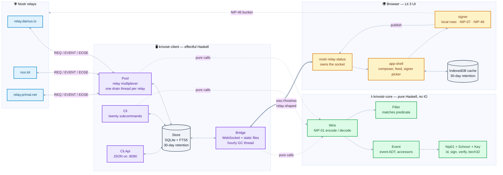

# <p align="center">krivostr</p>

<p align="center"><code>K = Y (λM. λ⟨t,π,ρ⟩. t ρ @ π ▷ M)</code></p>

<p align="center"><strong>Blazing-fast Nostr client and bridge for people who follow way too many people.</strong></p>

<div align="center">

[](https://haskell.org)
[](https://lit.dev)
[](https://www.typescriptlang.org)
[](https://tailwindcss.com/)
[](LICENSE)


</div>

<div align="center">


</div>

<br>

<p align="center">See the client in action at https://krivostr-ui.pages.dev/</p>

With krivostr, everything you read lands in a SQLite file you own, indexed for full-text search, and
reachable from the command line. Relays forget; your store does not. The name is a
portmanteau of **Nostr** and **Krivine**, the call-by-name abstract machine that evaluates
lambda terms through a stack of closures.

- **One binary, twenty subcommands** — `serve`, `feed`, `search`, `dm`, `reply`,
  `react`, `repost`, `verify`, `publish`, `delete`, `resolve`, `comment`, `list`,
  `count`, `wallet`, `export`, `watch`, `api`, `reindex`, `keygen`. SQLite and FTS5
  are linked in; no runtime to install.
- **A store that outlives the browser** — events in SQLite with a 30-day retention
  window, indexed on `pubkey`, `created_at`, and `kind`, plus an FTS5 index for search.
- **A relay-shaped WebSocket bridge** — the browser speaks ordinary Nostr to `krivostr
  serve`, which answers from the local store and can fan out to upstream relays.
- **Signers at the boundary** — local `nsec` (NIP-49 `ncryptsec` encrypted at rest),
  NIP-07 browser extension, or NIP-46 remote bunker. The picker opens a modal
  with install links (Alby, nos2x, Flamingo) when NIP-07 is unavailable.
- **A pure core** — canonical serialization, signing, verification, and filter matching
  are pure Haskell with no IO in `krivostr-core`; SQLite, WebSockets, and HTTP live in
  `krivostr-client`.

---

## Contents

- [Quick start](#quick-start)
- [Installation](#installation)
- [Commands](#commands)
- [Configuration](#configuration)
- [Architecture](#architecture)
- [Protocol support](#protocol-support)
- [Testing and coverage](#testing-and-coverage)
- [Project structure](#project-structure)
- [Development](#development)
- [Design decisions](#design-decisions)
- [Known limitations](#known-limitations)
- [Roadmap](#roadmap)
- [License](#license)

---

## Quick start

### Download and run (no build)

Each [release](https://github.com/sagar-shirwalkar/krivostr/releases) ships the
binary **and** the built UI in one tarball — no clone, no toolchain, no Cloudflare
account. Extract and run; the archive mirrors the repo layout (`ui/dist`), so
`serve` finds the UI with zero flags:

```bash
mkdir krivostr && tar -xzf krivostr-0.5.5-linux-amd64.tar.gz -C krivostr
cd krivostr
./krivostr serve
```

Open <http://localhost:8081>. The bridge serves the UI, keeps your SQLite vault
(`.krivostr/events.db`), and works fully offline once relays have fed it.

### Build from source

**Prerequisites:** GHC 9.10.3 (pinned by Stack through `lts-24.61`), Stack, Node 22+,
pnpm 9+. Docker is optional.

```bash
git clone https://github.com/sagar-shirwalkar/krivostr
cd krivostr
make build
```

`make build` compiles the Haskell executable and the UI. Then start the bridge, which
also serves the built UI from `./ui/dist`:

```bash
stack exec krivostr serve
```

```
info  store: opened .krivostr/events.db
info  bridge: 3 upstream relays
info  bridge: listening on :8081
info  connected: wss://relay.damus.io
info  connected: wss://nos.lol
info  connected: wss://relay.primal.net
```

Open <http://localhost:8081>. The landing page explains the model; open the client,
choose a signer, and post.

For UI development with hot reload, run Vite alongside the bridge. Vite does not proxy
`/ws`, so point the UI at the bridge explicitly:

```bash
stack exec krivostr serve &                        # bridge on :8081
cd ui && VITE_BRIDGE_URL=ws://localhost:8081/ws pnpm dev   # Vite on :5173
```

### Fill the store, then search it

This is the part that makes the store worth having. Stream from a relay into SQLite,
then query it:

```bash
krivostr feed --follow --ingest --relay wss://nos.lol -n 3
```

```
now    #7368   4579cf15…4579cf152e756a938e169761baca157dd6cf9df983b4aedafa2a3537
now    #20000  9bddfd32…9bddfd3281e8685684f0ff6dddca8b7b220cc34d10cb5cd6232c7542  {"messageId":"","fromPeerId":"10f8563a…
```

```bash
krivostr search peerId -n 2
```

```
2 match(es) for peerId
now    #22668  00442745…004427456813179dfcfa8e14460977878a0af57e7f4daf520e804fdd  {"peerId":"u4Cp55I9uwnnXAw3ssRS"}
now    #22870  a8a5efbd…a8a5efbdcb5e5d262523c8e9feac4c2915b56f27e33d9118c2b02d3f  {"peerId":"ICTHnCqgP7JUc8J1zdZ7"}
```

The first command talks to a relay and writes to SQLite; the second never touches the
network. That is the whole idea.

---

## Installation

### Backend

```bash
stack build --fast
stack exec krivostr serve
```

### UI

The UI is a static bundle. `krivostr serve` serves `./ui/dist` when it exists, so a
built UI and the bridge are one process on one port.

```bash
cd ui
corepack enable
corepack prepare pnpm@9 --activate
pnpm install --frozen-lockfile
pnpm build              # output: ui/dist
pnpm dev                # dev server with hot reload on :5173
```

### Docker

```bash
make docker
docker compose -f docker/docker-compose.yml up
```

The image is `debian:bookworm-slim` with `libgmp10`, `zlib1g`, and `ca-certificates`, and
it runs under `tini` so the bridge gets correct signal handling. The container serves the
static UI and the bridge together, publishes `:8081`, and keeps the database at
`/data/events.db` on the `krivostr-data` volume.

The published Linux binary is built by `docker/Dockerfile.linux` and checked for a glibc
floor of 2.33. It is **not** a fully static build: it links against glibc, `libgmp`, and
`libz`, so it runs on any Linux with glibc 2.33 or newer.

---

## Commands

Global flags come before the subcommand:

| Flag | Environment | Default | Meaning |
|---|---|---|---|
| `--db PATH` | `KRIVOSTR_DB` | `.krivostr/events.db` | SQLite database |
| `--log-level LEVEL` | `KRIVOSTR_LOG_LEVEL` | `info` | `debug`, `info`, `warn`, `error` |
| `--color` / `--no-color` | — | auto | Force or suppress ANSI colour |
| `--version` | — | — | Print the version and exit |

| Command | What it does |
|---|---|
| `serve` | Run the bridge: WebSocket plus static UI |
| `feed` | Read the store; `--follow` streams live |
| `search` | Full-text search over the local store |
| `dm` | Send a DM (NIP-04 today, NIP-17 planned), or `--inbox` to read yours |
| `reply` | Reply to a note (NIP-10, marked `e` tags) |
| `react` | React to an event (NIP-25 kind 7, `--emoji`, default `+`) |
| `repost` | Repost (kind 6/16) or quote with `--quote` (NIP-18) |
| `verify` | Check a NIP-05 identifier against its domain |
| `publish` | Publish a Markdown file as a long-form article (NIP-23) |
| `delete` | Request deletion of your events (NIP-09), removes locally |
| `resolve` | Resolve a `nostr:` reference, bech32, or hex (NIP-27) |
| `comment` | Comment on a non-note event by id or address (NIP-22) |
| `list` | Show or edit a NIP-51 list: `mute`, `pin`, `bookmark` |
| `count` | Count stored events matching a filter (NIP-45) |
| `wallet` | Talk to a lightning wallet: `balance`, `info`, `pay`, `invoice` (NIP-47) |
| `export` | Bulk export as `nostr` (ndjson), `array`, or `csv` |
| `watch` | Notify on new events |
| `api` | Run the JSON HTTP API on its own port |
| `reindex` | Rebuild the full-text search index |
| `keygen` | Generate an `nsec` / `npub` pair |

### `feed`

```bash
krivostr feed                                  # recent events from the store
krivostr feed -k note -n 20                    # kind 1 only
krivostr feed -a npub1… -t e=<event-id>        # by author, or by tag
krivostr feed --since 2h --json                # time window, one JSON event per line
krivostr feed --follow --ingest                # stream from relays and store what arrives
```

Filter flags shared by `feed`, `search`, `export`, and `watch`: `-k/--kind` (`note`, `dm`,
`like`, `repost`, `delete`, `metadata`, `follow`, `relays`, or a number), `-a/--author`
(`npub` or hex), `-t/--tag NAME=VALUE`, `--since`, `--until`, `-n/--limit`,
`-s/--search` (NIP-50 full text — FTS5 locally, forwarded to relays).

### `search`

```bash
krivostr search "gm" --any -n 20               # any word, not all
krivostr search nostr -k note --since 7d
```

### `dm`

Needs a secret key in `KRIVOSTR_NSEC`; `krivostr keygen` prints a fresh pair.

```bash
export KRIVOSTR_NSEC=nsec1…
krivostr dm npub1… "the message"
krivostr dm --inbox                           # decrypt kind 4 events addressed to you
```

DMs are NIP-04 (AES-256-CBC under an ECDH shared secret). NIP-04 is deprecated in favour
of NIP-44; see [Known limitations](#known-limitations). The NIP-17 stack — kind 14
rumor, NIP-44 seal, gift wrap — is implemented and tested in Haskell and
TypeScript, but `dm` still sends kind 4.

### `export`, `watch`, `api`, `reindex`, `keygen`

```bash
krivostr export -k note --since 30d --format csv --out notes.csv
krivostr watch -a npub1… --exec 'notify-send "{content}"'   # {json} {content} {author} {kind}
krivostr watch --print-unit > ~/.config/systemd/user/krivostr-watch.service
krivostr api --port 8090                      # GET /health /stats /events /events/:id /search
krivostr reindex                              # rebuild FTS5 after an import
krivostr keygen
```

---

## Configuration

| Variable | Default | Meaning |
|---|---|---|
| `KRIVOSTR_DB` | `.krivostr/events.db` | SQLite path |
| `KRIVOSTR_LOG_LEVEL` | `info` | `debug` / `info` / `warn` / `error` |
| `KRIVOSTR_PORT` | `8081` | Bridge port (`serve`) |
| `KRIVOSTR_STATIC_DIR` | `./ui/dist` | Static asset directory |
| `KRIVOSTR_API_HOST` | `127.0.0.1` | Interface for `api` |
| `KRIVOSTR_NSEC` | — | Secret key for `dm` |
| `KRIVOSTR_NWC` | — | Wallet connection URI for `wallet` (NIP-47) |

UI variables are read by Vite at build time, so they must be set before `pnpm build`:

| Variable | Default | Meaning |
|---|---|---|
| `VITE_BRIDGE_URL` | same origin | Where the browser opens its WebSocket, e.g. `ws://localhost:8081` |
| `VITE_KRIVOSTR_TRANSPORT` | `relay` | `bridge` or `relay` |

`?transport=bridge` in the URL sets the same choice at runtime. The transport switch is
honoured by the relay-status element, which owns the browser's Nostr socket; the rest of
the UI reads from that element.

---

## Architecture



The Haskell and TypeScript sides deliberately mirror each other: fallible operations are
`Result`s, effects are `IO`s, and optionality is `Maybe`. Same shape on both sides,
no cross-language FFI. (Filter *matching* is a hand-rolled predicate on both sides rather
than the `Rule` algebra — see [docs/architecture.md](docs/architecture.md).)

- **`core/`** — pure Haskell: NIP-01 serialization/signing/verification, NIP-05
  identifiers, NIP-10 replies, NIP-13 proof of work, NIP-18 reposts, NIP-23
  articles, NIP-25 reactions, NIP-40 expiration, NIP-42 AUTH, NIP-44 v2
  encryption, NIP-46 nostr-connect, NIP-49 `ncryptsec`, NIP-50 search filter,
  NIP-59 gift wrap, NIP-17 private DMs, NIP-11 relay info, NIP-65 relay hints,
  filter predicates, wire ADTs, `Writer`-based logging.
- **`client/`** — effectful Haskell: relay pool, SQLite store (FTS5),
  WebSocket bridge, HTTP API, CLI (20 subcommands).
- **`ui/`** — browser: Lit 3, hand-rolled `Maybe` / `Result` / `IO` / `Rule`, IndexedDB
  cache, signer plug-ins (NIP-07, NIP-46 modal).

See [docs/architecture.md](docs/architecture.md) for more detail.

---

## Protocol support

| NIP | Title | Status |
|---|---|---|
| 01 | Basic protocol | ✅ full — variadic `REQ` filters, `EVENT`, `EOSE`, `OK`, `NOTICE`, `CLOSED` |
| 02 | Follow list | ❌ not implemented |
| 04 | Encrypted direct messages | ◐ CLI can send; UI cannot read (NIP-04 only) |
| 05 | DNS identifiers | ✅ parse + HTTPS verify (`krivostr verify`, UI logic) |
| 07 | `window.nostr` | ✅ full |
| 09 | Event deletion | ✅ kind 5, `krivostr delete`, local removal + UI hide |
| 10 | Reply conventions | ✅ marked + positional `e` tags, `krivostr reply`, UI threads |
| 13 | Proof of work | ✅ `nonce` tag, leading-zero-bit difficulty, committed target |
| 18 | Reposts | ✅ kind 6/16 + `q` quotes, `krivostr repost`, UI rendering |
| 19 | bech32 entities | ✅ keys + `nevent`/`naddr` TLV pointers, both sides |
| 21 | `nostr:` URIs | ✅ single-reference parse; UI mentions open in-client |
| 22 | Comments | ✅ kind 1111 root/parent scopes, `krivostr comment`, UI threads |
| 23 | Long-form content | ✅ kind 30023 articles, `krivostr publish`, UI rendering |
| 25 | Reactions | ✅ kind 7 `e`/`p`/`k`, `krivostr react`, UI counts |
| 27 | Text note references | ✅ `nostr:` scanning, `krivostr resolve`, UI mentions |
| 36 | Sensitive content | ✅ `content-warning`, CLI gate, UI blur-to-reveal |
| 40 | Expiration timestamp | ✅ `expiration` tag helpers; purge is retention-based |
| 42 | Authentication | ✅ kind 22242 challenge/response, wired into the relay pool |
| 44 | Versioned encryption | ✅ NIP-44 v2 — ChaCha20 + HMAC, official vectors |
| 45 | Counting results | ✅ wire `COUNT`, bridge SQLite answer, `krivostr count` |
| 46 | Remote signer | ✅ bunker over NIP-44, wired into the signer picker |
| 47 | Wallet connect | ✅ NIP-44 requests/responses, `krivostr wallet`, UI zap payment path |
| 49 | Private-key encryption | ✅ `ncryptsec` — scrypt + XChaCha20-Poly1305 |
| 50 | Search | ✅ wire `search` filter; bridge FTS5, CLI `--search`, UI search box |
| 51 | Lists | ✅ mute/pin/bookmark, `krivostr list`, UI mute filtering |
| 57 | Lightning zaps | ✅ kind 9734 + 9735 receipts, LNURL flow, UI zap dialog |
| 59 | Gift wrap | ✅ rumor → seal (kind 13) → wrap (kind 1059), official vectors |
| 17 | Private direct messages | ✅ kind 14 rumor → seal → wrap, ±2 day jitter |
| 11 | Relay info | ✅ `RelayInfo` document with `supported_nips` |
| 65 | Relay list metadata | ◐ kind 10002 drives CLI read relays; `writeRelays` unused |

---

## Testing and coverage

```bash
make test          # backend (stack test) + UI unit + UI browser
make test-backend  # 629 hspec examples across core and client
make test-ui       # 126 unit tests (jsdom) + 15 browser tests (real Chromium)
```

Browser tests run through `@vitest/browser` and Playwright against real Chromium. They
exercise the Lit elements end to end: rendering, event emission, attribute reflection,
and lifecycle. On a fresh clone, `make test-ui` installs the Playwright browser first;
without that step the browser project fails with `Executable doesn't exist at …`.

Coverage:

```bash
make coverage          # backend and UI
cd ui && pnpm coverage # v8, thresholds 80/80/80/80
```

Backend coverage is reported by `scripts/hpc-coverage.py`, which reads the HTML index
that `stack test --coverage` writes:

```
coverage index: .stack-work/install/…/9.10.3/hpc/combined/all/hpc_index.html
module                  covered / total
Krivostr.Schnorr             16 / 16     100.0%
Krivostr.Nip.Nip01            4 / 4      100.0%
Krivostr.Store               29 / 38      76.3%
Krivostr.Key                 22 / 30      73.3%
Krivostr.Filter              16 / 27      59.3%
…
TOTAL                      164 / 460     35.7%
```

That is the honest number, and it is lower than you would like. The cryptography and the
NIP-01 layer are fully covered; the IO layers — the relay pool, the bridge, the CLI, and
the HTTP API — are not yet, and they dominate the total. `.hpc-threshold` sets the target
at 80%, so `make coverage` fails today by design: the gap is visible rather than hidden.

UI coverage is a different story, because the vitest config measures the pure logic
(`src/fp` and `src/nostr`, excluding the bridge transport):

```
All files    |   95.73 |    93.27 |   89.13 |   95.73 |
```

---

## Project structure

```
krivostr/
├── core/                          Pure Haskell library
│   ├── src/Krivostr/
│   │   ├── Event.hs               Event ADT and accessors
│   │   ├── Filter.hs              onlyKinds / byAuthors / tagEq / matches
│   │   ├── Key.hs                 x-only keys, NIP-19 npub + nsec
│   │   ├── Logging.hs             Writer logger
│   │   ├── Schnorr.hs             BIP-340 in pure Haskell
│   │   ├── Wire.hs                NIP-01 + NIP-45 message ADTs, encodeClient / decodeRelay
│   │   └── Nip/
│   │       ├── Nip01.hs           Canonical bytes, event id, signing, verification
│   │       ├── Nip05.hs           DNS identifiers: parse, well-known URL, verify
│   │       ├── Nip09.hs           Deletion: kind 5, authorship, addresses
│   │       ├── Nip10.hs           Replies: marked/positional e tags, thread refs
│   │       ├── Nip11.hs           Relay info document (supported_nips)
│   │       ├── Nip13.hs           Proof of work: difficulty, nonce tag, mining
│   │       ├── Nip17.hs           Private DMs: kind 14 rumor, timestamp jitter
│   │       ├── Nip18.hs           Reposts (6/16) and q-tag quotes
│   │       ├── Nip19.hs           Entities: nevent/naddr TLV pointers
│   │       ├── Nip21.hs           nostr: URIs: single-reference parse
│   │       ├── Nip22.hs           Comments: kind 1111 root/parent scopes
│   │       ├── Nip23.hs           Long-form: slug, header tags, address
│   │       ├── Nip25.hs           Reactions: kind 7, counts
│   │       ├── Nip27.hs           Text references: nostr: scanning, TLV
│   │       ├── Nip36.hs           Sensitive content: content-warning tag
│   │       ├── Nip40.hs           Expiration tag parsing and filtering
│   │       ├── Nip42.hs           AUTH: kind 22242 build and validate
│   │       ├── Nip44.hs           NIP-44 v2: HKDF, ChaCha20, HMAC, padding
│   │       ├── Nip46.hs           nostr-connect: bunker URI, methods, requests
│   │       ├── Nip47.hs           wallet connect: NWC URI, methods, codecs
│   │       ├── Nip49.hs           ncryptsec: scrypt + XChaCha20-Poly1305
│   │       ├── Nip51.hs           Lists: mute, pins, bookmarks
│   │       ├── Nip57.hs           Zaps: kind 9734/9735, invoice amounts
│   │       ├── Nip59.hs           Gift wrap: rumor, seal (13), wrap (1059)
│   │       └── Nip65.hs           Relay hints
│   └── test/
│       ├── Spec.hs                hspec
│       ├── Bip340.hs              BIP-340 test vectors
│       └── Nip*Spec.hs            One spec module per NIP, official vectors
├── client/                        Effectful Haskell executable
│   ├── app/
│   │   └── Main.hs                Entry point (app/, not src/: see below)
│   ├── src/
│   │   └── Krivostr/
│   │       ├── Bridge.hs          WebSocket bridge + static files (NIP-42 auth)
│   │       ├── Cli.hs             optparse-applicative command surface
│   │       ├── Cli/
│   │       │   ├── Api.hs         JSON HTTP API
│   │       │   ├── Nostr.hs       Network commands: dm, publish, relay defaults
│   │       │   └── Render.hs      Terminal rendering
│   │       ├── Pool.hs            Relay multiplexer
│   │       ├── Relay.hs           One relay connection
│   │       └── Store.hs           SQLite, FTS5
│   └── test/Spec.hs
├── ui/                            Lit 3 + TypeScript
│   ├── public/_headers            Cloudflare Pages CSP and cache rules
│   ├── src/
│   │   ├── fp/                    Hand-rolled Maybe / Result / IO / Rule
│   │   ├── nostr/
│   │   │   ├── signer.ts          Signer interface (local, NIP-07, NIP-46)
│   │   │   └── cache.ts           IndexedDB
│   │   └── components/
│   │       ├── app-shell.ts       View switcher (landing ↔ app)
│   │       ├── krivostr-landing.ts  Landing with clickable logo, Nostr link, Paul Revere quote
│   │       ├── krivostr-signer-picker.ts  Modal for NIP-07 extensions
│   │       └── ...                Compose, feed, relay status
│   └── src/__tests__/             Vitest unit + browser projects
├── scripts/
│   ├── check-coverage.sh          Enforces .hpc-threshold
│   └── hpc-coverage.py            Coverage report from the HPC HTML index
├── docs/                          Architecture, protocol, security, storage
├── docker/                        Dockerfile, Dockerfile.linux, compose
├── .github/workflows/             ci.yml, ui.yml, release.yml
├── Makefile
└── stack.yaml
```

---

## Development

```bash
make build             # backend + UI
make build-backend     # stack build --fast
make build-ui          # pnpm install + pnpm build
make test              # backend + UI unit + UI browser
make test-backend      # stack test
make test-ui           # unit + browser
make test-ui-browser   # browser tests only
make coverage          # backend + UI coverage reports
make docker            # build the runtime image
make clean             # remove build artifacts
```

`stack.yaml` resolves everything from `lts-24.61` with no extra dependencies, so
`stack build` is reproducible from that file alone. See
[docs/development.md](docs/development.md) for the longer version.

---

## Design decisions

- **The core is pure.** Signing, hashing, filter matching, and wire encoding are pure
  functions. Everything that performs IO lives in `client`.
- **The bridge is a personal relay.** Same wire protocol as a relay, backed by SQLite,
  single-user, on your machine.
- **Retention is a policy, not a default.** Ordinary events expire after 30 days;
  persistent kinds — DMs, follows, metadata, and relay lists — never do. The policy
  lives in `Store.hs` and `cache.ts` and is applied identically on both sides.
- **Ingest is idempotent.** Events are inserted with `INSERT OR IGNORE` on the event id,
  so re-streaming the same relay changes nothing.
- **The UI re-expresses the algebra.** Fallible operations are `Result`s and effects are
  `IO`s. The `Rule`/`Predicate` combinators in `fp/algebra.ts` exist but nothing in the
  app uses them yet; only the algebra's own test imports that module.

---

## Known limitations

Worth stating plainly, because the rest of this README is otherwise optimistic.

- **Ingest trusts nothing.** `Store.insertEvent` verifies every signature and answers
  `Inserted` / `Duplicate` / `InvalidSignature`; the browser cache refuses forgeries too.
- **Backend test coverage is 54%**, pinned by a ratchet (`.hpc-threshold`): the build
  fails when coverage drops. The NIP modules are well covered; the relay pool, bridge,
  CLI, and HTTP API are not.
- **The local signer keeps the secret in memory for the session only.** There is no
  at-rest encryption and nothing is written to disk, but there is also no keyring
  integration.
- **The Linux binary is not static.** It needs glibc 2.33+, `libgmp`, and `libz`.
- **Upstream `search` depends on the relay.** The bridge answers from FTS5; remote
  relays without NIP-50 ignore the `search` key and return unfiltered matches.
- **`_headers` applies to Cloudflare Pages only.** `krivostr serve` serves the same files
  without the CSP.
- **`export --filter` takes positional flags**, and `dm @alice` is not accepted; pass an
  `npub` or hex key.

---

## Roadmap

### Near-term

- Tests for the IO layers, to move backend coverage off the floor.
- **NIP-02** — parse and honour kind 3 follow lists.
- **NIP-13** — inbound filter with configurable difficulty threshold.

### Medium-term

- **NIP-02** — parse and honour kind 3 follow lists.
- **NIP-17** — switch `dm` from NIP-04 to gift-wrapped kind 14.
- **NIP-49** — encrypt the local signer's key at rest with `ncryptsec`.

---

## License

[GNU Affero General Public License v3.0](LICENSE) — SPDX `AGPL-3.0-only`.

The AGPL covers the Haskell backend and the TypeScript UI together; both are
released under these terms.

Section 13 asks that users interacting with the software over a network be
offered its source. `krivostr serve` is exactly such a service, so this
repository is that offer: <https://github.com/sagar-shirwalkar/krivostr>
