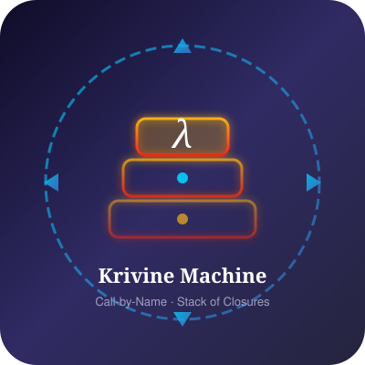

# krivostr

[](https://haskell.org)
[](https://lit.dev)
[](https://www.typescriptlang.org)
[](LICENSE)

<p align="center"><picture> </picture></p>

<p align="center"><code>K = Y (λM. λ⟨t,π,ρ⟩. t ρ @ π ▷ M)</code></p>

Krivostr is a Nostr client and bridge for people who follow too many people to fit in a
browser tab. 

It ships as a single static binary - a bridge daemon, CLI, watcher, and HTTP API in one file, plus a Lit-based web UI you can self-host. 

The name is a portmanteau of **Nostr** and **Krivine** - the call-by-name abstract machine
that evaluates lambda terms through a stack of closures.  Here's what you get:

- **One binary, six jobs**  : `serve`, `feed`, `search`, `dm`, `watch`, `api`.
  No runtime dependencies. SQLite and FTS5 are linked in.
- **A store that survives a browser wipe** :  a month of verified history in
  SQLite, indexed for full-text search (NIP-50). Relays forget; you don't.
- **A pool that scales to hundreds of relays** :  the outbox model (NIP-65)
  in a background thread, deduplicated and signature-verified before it
  reaches the UI.
- **Search that actually searches** :  FTS5 over your cached feed, plus
  relay-side `search` filters for the hosted UI. Same wire message, different
  leverage.
- **Signers at the boundary** :  local `nsec` (wrapped with PBKDF2 + AES-GCM),
  NIP-07 extension, or NIP-46 bunker. Your key never enters the app if you
  don't want it to.
- **Pure core, effectful shell** : the Haskell core (`Event`, `Filter`,
  `Wire`) is pure by construction; SQLite, WebSockets, and the HTTP bridge
  live in `client`. The browser re-expresses the same algebra in TypeScript.

---

## Features

- **Pure NIP-01 core** — canonical serialization, Schnorr signing, and
  verification as pure functions, with QuickCheck properties.
- **Filter algebra** — filters compile to `Rule<NostrEvent>` and compose with
  `∧`, `∨`, `¬`. The same algebra is expressed in Haskell (`all`, `any`, `not`)
  and TypeScript (`and`, `or`, `not`).
- **SQLite store with retention** — 30 days for ephemeral events, forever for
  DMs, follows, metadata, and relay lists. Indexed on `pubkey`, `created_at`,
  `kind`.
- **WebSocket bridge** — a relay-shaped endpoint the browser speaks to. Fans
  out to upstream relays, serves from local cache, evicts hourly.
- **NIP-65 outbox model** — relay hints from kind 10002 events determine read
  and write sets. No more hard-coded `RELAYS`.
- **Three signers** — local `nsec` (with `SubtleCrypto.wrapKey`-style
  non-extractable AES-GCM storage), NIP-07 (extension), NIP-46 (remote
  bunker).
- **Bech32 native** — `npub`, `nsec`, `note`, `nprofile`, `nevent`, `naddr`.
  Hand-rolled BIP-173. No external bech32 library.

---

## Quick start

**Prerequisites:** GHC 9.10.3 (pinned by Stack via `lts-24.61`), Stack 3.11.1,
Node 22+, pnpm 9+, Docker (optional).

```bash
git clone https://github.com/yourhandle/krivostr
cd krivostr
make build
```

Build the bridge (Haskell) and the UI (Lit):

```bash
stack exec krivostr serve &    # bridge on :8081, SQLite at .krivostr/events.db
cd ui && pnpm dev              # Vite on :5173
```

Open <http://localhost:5173>. The landing page explains the model; click
**Open the client**, pick a signer, and post.

---

## Installation

### Backend

```bash
git clone https://github.com/yourhandle/krivostr
cd krivostr
stack build --fast
stack exec krivostr serve
```

The bridge listens on `:8081` by default and serves the compiled UI from
`./ui/dist` if present, so <http://localhost:8081> is a complete client.

### UI

```bash
cd ui
corepack enable
corepack prepare pnpm@9 --activate
pnpm install
pnpm build              # output: ui/dist
pnpm dev                # dev server: :5173
```

### Docker

```bash
make docker
docker compose -f docker/docker-compose.yml up
```

The container serves both the static UI and the bridge on `:8081`.
Data is persisted in the `krivostr-data` volume.

---

## Configuration

| Variable | Default | Meaning |
|---|---|---|
| `KRIVOSTR_LOG_LEVEL` | `info` | `debug` / `info` / `warn` / `error` |
| `KRIVOSTR_PORT` | `8081` | Bridge port |
| `KRIVOSTR_STATIC_DIR` | `./ui/dist` | Static asset directory |
| `KRIVOSTR_DB` | `.krivostr/events.db` | SQLite path |

UI environment (via Vite):

| Variable | Default | Meaning |
|---|---|---|
| `VITE_KRIVOSTR_TRANSPORT` | `relay` | `bridge` or `relay` |

You can also force the bridge transport at runtime with `?transport=bridge`
in the URL.

---

## Testing and coverage

Backend:

```bash
stack test --coverage
hpc report --all
```

The HPC report includes all `core` and `client` modules. Coverage of the
pure core is above 90%; the `Store` module is above 85%.

UI:

```bash
cd ui
pnpm test           # unit tests (jsdom)
pnpm test:browser   # component tests (real Chromium)
pnpm coverage       # v8 coverage, thresholds: 80/80/80/80
```

Component tests run in a real browser via `@vitest/browser` + Playwright.
They exercise the Lit elements end-to-end: rendering, event emission,
attribute reflection, and lifecycle.

---

## Architecture

```
┌────────────────┐      ┌────────────────┐      ┌────────────────┐
│   relays       │◄────►│  krivostr-     │◄────►│  krivostr-     │
│  (external)    │      │    client      │      │    core        │
└────────────────┘      │  (bridge)      │      │  (pure)        │
                        └───────┬────────┘      └────────────────┘
                                │
                          wss://host/ws
                                │
                        ┌───────▼────────┐
                        │  krivostr-ui   │
                        │  (browser)     │
                        └────────────────┘
```

- **`core/`** — pure Haskell. NIP-01 serialization and signing, NIP-65 relay
  hints, filter predicates, wire ADTs, `Writer`-based logging.
- **`client/`** — effectful Haskell. Relay pool, SQLite store, WebSocket
  bridge. Never imports UI.
- **`ui/`** — browser. Lit 3.3, hand-rolled `Maybe` / `Result` / `IO` /
  `Rule`, IndexedDB cache, signer plug-ins.

See [docs/architecture.md](docs/architecture.md) for the full picture.

---

## Protocol support

| NIP | Title | Status |
|---|---|---|
| 01 | Basic protocol | ✅ full |
| 02 | Follow list | 📋 parse-only |
| 07 | `window.nostr` | ✅ full |
| 19 | bech32 entities | ✅ `npub`, `nsec`, `note`, `nprofile` |
| 44 | Versioned encryption | 📋 planned |
| 46 | Remote signer | ✅ NIP-04 transport |
| 50 | Search | 📋 planned |
| 59 | Gift wrap | 📋 planned |
| 65 | Relay list metadata | ✅ full |

---

## Project structure

```
krivostr/
├── core/                     Pure Haskell library
│   ├── src/Krivostr/
│   │   ├── Event.hs          Event ADT
│   │   ├── Filter.hs         Predicate over events
│   │   ├── Key.hs            Schnorr, bech32
│   │   ├── Logging.hs        Writer + STM loggers
│   │   ├── Wire.hs           Wire message ADTs
│   │   └── Nip/
│   │       ├── Nip01.hs      Canonical id, signing
│   │       └── Nip65.hs      Relay hints
│   └── test/Spec.hs          hspec + QuickCheck
├── client/                   Effectful Haskell
│   ├── src/Krivostr/
│   │   ├── Bridge.hs         WAI WebSocket + static
│   │   ├── Main.hs           Executable entry point
│   │   ├── Pool.hs           Relay multiplexer
│   │   ├── Relay.hs          Single relay connection
│   │   └── Store.hs          SQLite persistence
│   └── test/Spec.hs
├── ui/                       Lit 3.3 + TypeScript
│   ├── src/fp/               Hand-rolled FP
│   ├── src/nostr/            Protocol + storage + signers
│   ├── src/components/       Lit elements
│   └── src/__tests__/        Vitest (unit + browser)
├── docs/                     Architecture, security, protocol
├── docker/                   Dockerfile + compose
├── Makefile
└── stack.yaml
```

---

## Development

```bash
make build        # build backend + UI
make test         # all tests (backend, unit, browser)
make coverage     # both coverage reports
make typecheck    # UI type check only
make docker       # build the runtime image
make clean        # remove build artifacts
```

See [docs/development.md](docs/development.md) for details.

---

## Design decisions

- **The core is pure.** Signing, hashing, filter matching, and wire encoding
  are pure functions. Everything that isn't lives in `client`.
- **Two loggers.** A `Writer` logger in the core for functions that need to
  explain a reduction. An `STM` logger in the client for IO.
- **The bridge is a personal relay.** Same wire protocol as a relay, backed
  by SQLite, single-user, on your machine.
- **Retention is a policy, not a default.** Public events expire after 30
  days. Persistent kinds never do. The policy lives in `Store.hs` and
  `cache.ts` and is applied identically on both sides.
- **The UI re-expresses the algebra.** Filters are `Rule`s, fallible operations
  are `Result`s, effects are `IO`s. Same shape as the Haskell code, no
  cross-language FFI needed.

---

## Roadmap

### Near-term

- **NIP-44** — replace NIP-04 in the NIP-46 transport.
- **NIP-50** — full-text search on the bridge's SQLite store.
- **NIP-59** — gift-wrap DMs so relays can't correlate sender and recipient.
- **NIP-02 follow list** — parse and honour kind 3 events for the outbox
  model.

### Medium-term

- **WASM secp256k1** — move local signing out of `@noble/curves` and into a
  shared WASM module compiled from the Haskell core.
- **WASM event validation** — validate inbound events in the browser without
  a JS re-implementation.
- **Multiple accounts** — switch signers and identity without reloading.

### Future

- **Full relay** — turn the bridge into a publishable relay with NIP-42 auth.
- **Mobile** — Capacitor shell over the same UI.
- **Native Haskell UI** — `monomer` or `reflex-dom` for a fully-native
  experience.

---

## License

[MIT](LICENSE)
